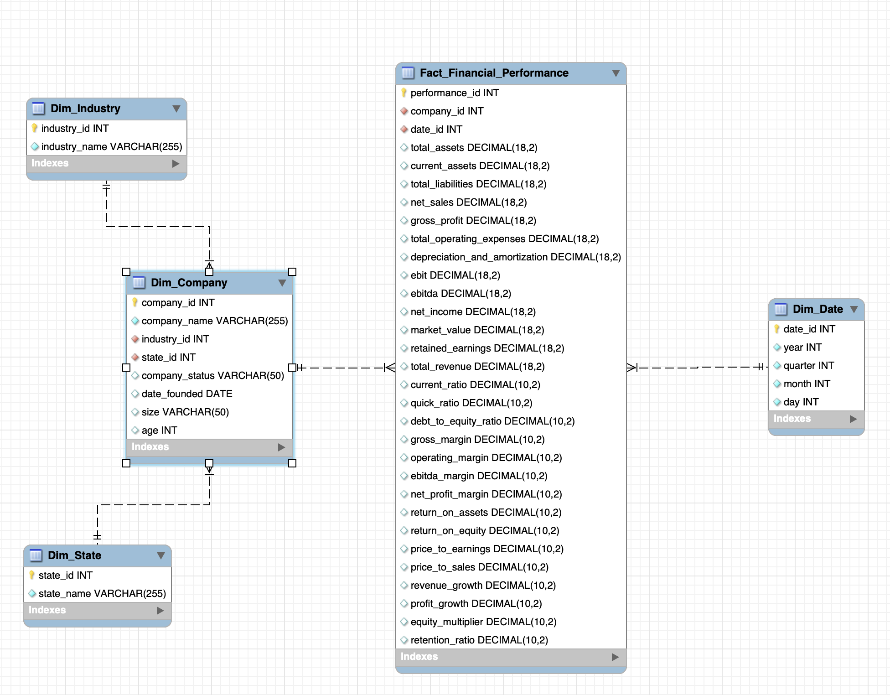
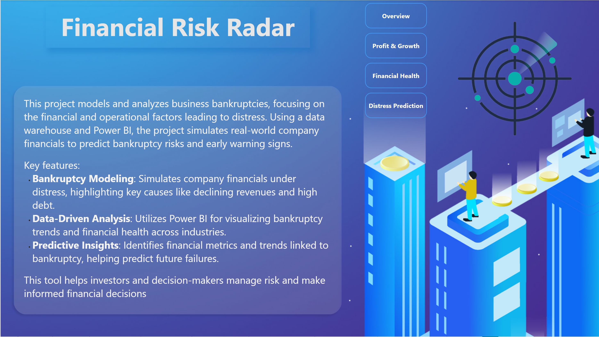
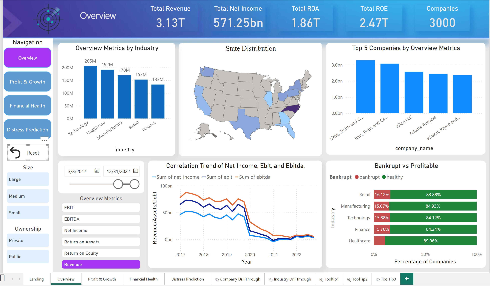

<br><br>

<!-- project philosophy -->


---

> A comprehensive platform for analyzing financial metrics and predicting the success and financial distress of businesses, making it easier for stakeholders to gain insights and make informed decisions.
>
> Financial Insight aims to streamline the financial analysis process by providing a robust, user-friendly platform for analyzing key performance indicators (KPIs) and financial health. We believe in enhancing business forecasting and strategic decision-making by enabling companies to monitor their financial performance and predict potential risks.

### User Stories
- As a business owner, I want to track my company’s financial metrics, so I can understand my company's financial health.
- As a financial analyst, I want to analyze profitability and liquidity ratios, so I can assess the company’s operational efficiency.
- As an investor, I want to predict potential financial distress, so I can make more informed investment decisions.

---

<br><br>
<!-- Tech stack -->


---

This project utilizes **Python** for data preprocessing, financial analysis, and machine learning model development. Python’s rich ecosystem of libraries, including **pandas**, **numpy**, and **scikit-learn**, allows for advanced data manipulation and predictive modeling.

- For data version control and drift detection, we use **DVC** to manage datasets, ensuring version tracking and facilitating smooth collaboration. **DVC** also enables seamless data loading and retrieval from **AWS S3**, where the raw data is stored.
  
- **AWS S3** is used for data storage, with raw data being uploaded and retrieved during preprocessing steps. Processed data is then stored in **MySQL**, allowing efficient querying and integration with analytics platforms.

- **SQL** is used to query the financial data warehouse and generate reports. Structured queries extract insights and transform data for further analysis, loading dataframes into the data warehouse.

- **Power BI** is used for dynamic reporting, utilizing **DAX (Data Analysis Expressions)** and **M Query** to calculate KPIs and design interactive dashboards. These tools visualize financial metrics, track trends, and predict financial outcomes.

- For machine learning tasks, such as predicting business financial distress, **scikit-learn** and **XGBoost** are used for model building, training, and evaluation.

- All visualizations and reports are done through **Power BI**, providing stakeholders with interactive dashboards to monitor real-time financial performance.

---

<br><br>

<!-- Data Warehouse Schema -->


>###  Architecting Data Warehouse Strategies:



---

<br><br>


<!-- Implementation -->


### Dashboard Screens
| Landing | Overview |
| ---| ---| 
 |  |
|Financial Health | Profitability & Growth |
  |  |
 Distress Prediction |
  |

---

<br><br>
 
 ---

> To ensure the financial data in this project is realistic and adheres to fundamental business principles, we implemented a robust data validation process. This process maintains logical relationships between financial variables and introduces normalization and standarization within business logic.

>#### Logical Relationships

 The following key financial relationships are defined:

- **Gross Profit**: `gross_profit = net_sales - cost_of_goods_sold`
- **EBIT (Earnings Before Interest and Taxes)**: `ebit = gross_profit - total_operating_expenses - depreciation_and_amortization`
- **EBITDA**: `ebitda = ebit + depreciation_and_amortization`
- **Net Income**: `net_income = ebit - total_long_term_debt`
- **Assets and Liabilities**: `total_liabilities ≤ total_assets`
- **Market Value**: Dependent on `net_income` and `ebitda`.

>#### Validation Steps

1. **Data Generation with Business Rules**:
   - Ensured values are within realistic business ranges.

2. **Applying Logical Relationships**:
   - Normalized dependent variables using the defined financial equations.
   - Standarized values to maintain consistency across all related variables.

3. **Consistency Checks**:
   - Verified that `total_liabilities` do not exceed `total_assets`.
   - Confirmed that all computed values make business sense.


---

<br><br>
 


 > To set up Financial Risk Radar locally, follow these steps:

### Prerequisites

1. **Python**:
    Miniconda offers several advantages over a standalone Python installation, especially for data science and scientific computing tasks.<br>
    Follow the [link](https://docs.anaconda.com/miniconda/) for installation.
    <br>
    1.1 install the required Python packages

    ```sh
    pip instal -r requirements.txt
    ```
    <br>
    1.2 clone the repo

    ```sh
    git clone https://github.com/assaad-ali/Financial-Risk-Radar.git
    cd Financial-Risk-Radar
    ```
    <br>
    1.3 install Python packages

    ```sh
    pip install -r requirements.txt
    ```

2. **MySQL**:
    Click [here](https://dev.mysql.com/downloads/) to download MySQL Workbecnk.<br>
    Click [here](https://dev.mysql.com/downloads/connector/) to download MySQL connector.<br >

3. **Power BI**: 
    only for Windows, click [here](https://www.microsoft.com/en-us/power-platform/products/power-bi/downloads) to download.

### Dashboard Setup
 Click [here](https://drive.google.com/file/d/1NKulQoFBTAnTkIoOgu-pk5os32XMt1io/view?usp=sharing) to download the Power BI file.