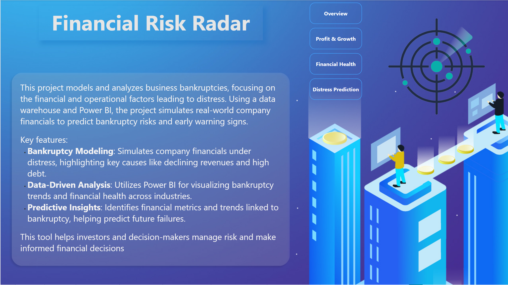
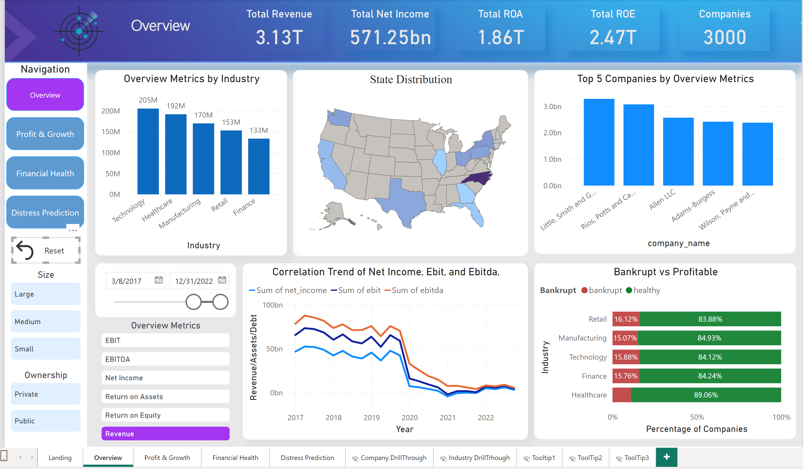

  

<!-- project philosophy -->

> A comprehensive platform for analyzing financial metrics and predicting the success and financial distress of businesses, making it easier for stakeholders to gain insights and make informed decisions.
>
> Financial Insight aims to streamline the financial analysis process by providing a robust, user-friendly platform for analyzing key performance indicators (KPIs) and financial health. We believe in enhancing business forecasting and strategic decision-making by enabling companies to monitor their financial performance and predict potential risks.

### User Stories
- As a business owner, I want to track my company’s financial metrics, so I can understand my company's financial health.
- As a financial analyst, I want to analyze profitability and liquidity ratios, so I can assess the company’s operational efficiency.
- As an investor, I want to predict potential financial distress, so I can make more informed investment decisions.

  
<!-- Tech stack -->

---

This project utilizes **Python** for data preprocessing, financial analysis, and machine learning model development. Python’s rich ecosystem of libraries, including **pandas**, **numpy**, and **scikit-learn**, allows for advanced data manipulation and predictive modeling.

- For data version control and drift detection, we use **DVC** to manage datasets, ensuring version tracking and facilitating smooth collaboration. **DVC** also enables seamless data loading and retrieval from **AWS S3**, where the raw data is stored.
  
- **AWS S3** is used for data storage, with raw data being uploaded and retrieved during preprocessing steps. Processed data is then stored in **MySQL**, allowing efficient querying and integration with analytics platforms.

- **SQL** is used to query the financial data warehouse and generate reports. Structured queries extract insights and transform data for further analysis, loading dataframes into the data warehouse.

- **Power BI** is used for dynamic reporting, utilizing **DAX (Data Analysis Expressions)** and **M Query** to calculate KPIs and design interactive dashboards. These tools visualize financial metrics, track trends, and predict financial outcomes.

- For machine learning tasks, such as predicting business financial distress, **scikit-learn** and **XGBoost** are used for model building, training, and evaluation.

- All visualizations and reports are done through **Power BI**, providing stakeholders with interactive dashboards to monitor real-time financial performance.

---

  

<!-- Database Design -->

###  Architecting Data Excellence: Innovative Database Warehouse Strategies:

  

<!-- Implementation -->

### Dashboard Screens
| Landing | Overview |
| ---| ---| 
 |  |
|Financial Health | Profitability & Growth |
  |  |
 Distress Prediction |
  |